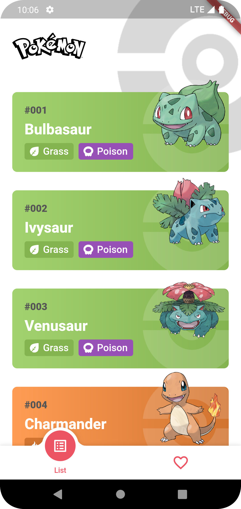
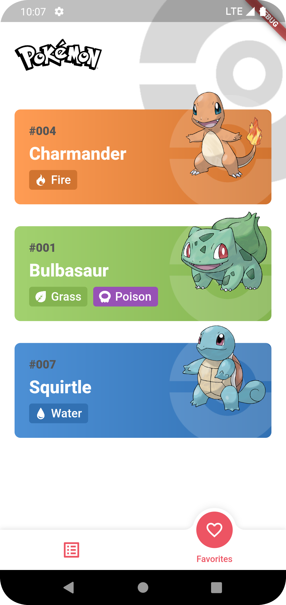
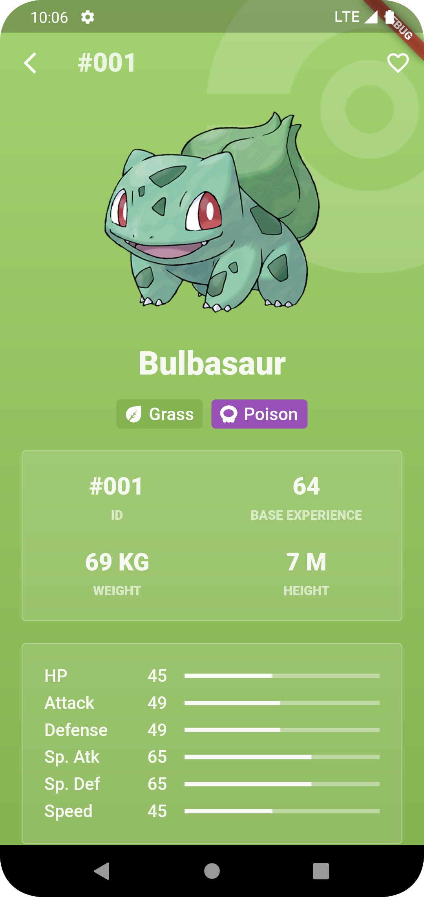
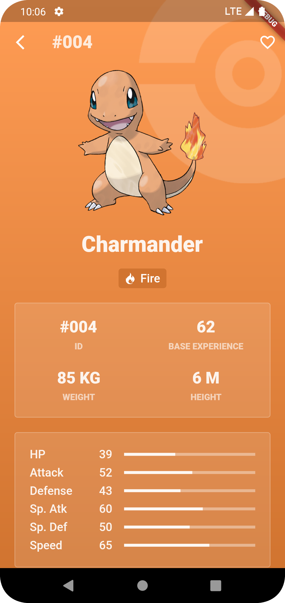

# Pokédex
Esse é um app desenvolvido em flutter/dart inspirado em uma Pokédex;
- O app exibe uma listagem paginada de Pokémons;
- Exibe os dados de cada pokémon separadamente;
- É possível adicionar o pokémon nos favoritos (armazenando os dados localmente);
- É possível ver os pokémons salvos localmente e offline em uma listagem separada;

## ➕ Principais bibliotecas/tecnologias utilizadas
- Gerenciamento de estado: [Cubit (BLoC)](https://pub.dev/packages/bloc), [Flutter_bloc](https://pub.dev/packages/flutter_bloc)
- Injeção de dependências: [Flutter Modular](https://pub.dev/packages/flutter_modular)
- Gerenciamente de rotas: [Flutter Modular](https://pub.dev/packages/flutter_modular)
- Requisições http: [Dio](https://pub.dev/packages/dio)
- Armazenamento local: [Hive](https://pub.dev/packages/hive)
- Testes: [Mocktail](https://pub.dev/packages/mocktail), [bloc_test](https://pub.dev/packages/bloc_test)

## 📐 Arquitetura
A arquitetura utilizada no app foi baseada na
[Clean Dart](https://github.com/Flutterando/Clean-Dart)
(Proposta de Arquitetura Limpa da Flutterando)

## 🌐 API
Foi utilizado a api [PokéApi](https://pokeapi.co/)

## 🔥 Build
Passo 1: [Instale o Flutter](https://docs.flutter.dev/get-started/install)
(Versão utilizada no desenvolvimento: 3.10.5)

Passo 2: Baixe ou clone este repositório usando o link abaixo:
```
https://github.com/GerlanStanley/pokedex.git
```

Passo 3: Vá para a raiz do projeto e execute o seguinte comando no console para obter as dependências necessárias:
```
flutter pub get
```

Passo 4: Para executar o projeto realize o comando
```
flutter run
```

## ✅ Testes
Foram implementados testes de unidades, widgets e integração

Para executar os testes de unidade e widget realize o comando
```
flutter test
```

Para executar os testes de integração realize o comando
```
flutter test integration_test
```

## 🖼️ Screenshots
<p float="left">
    
     
</p>
<p float="left">
    
     
</p>